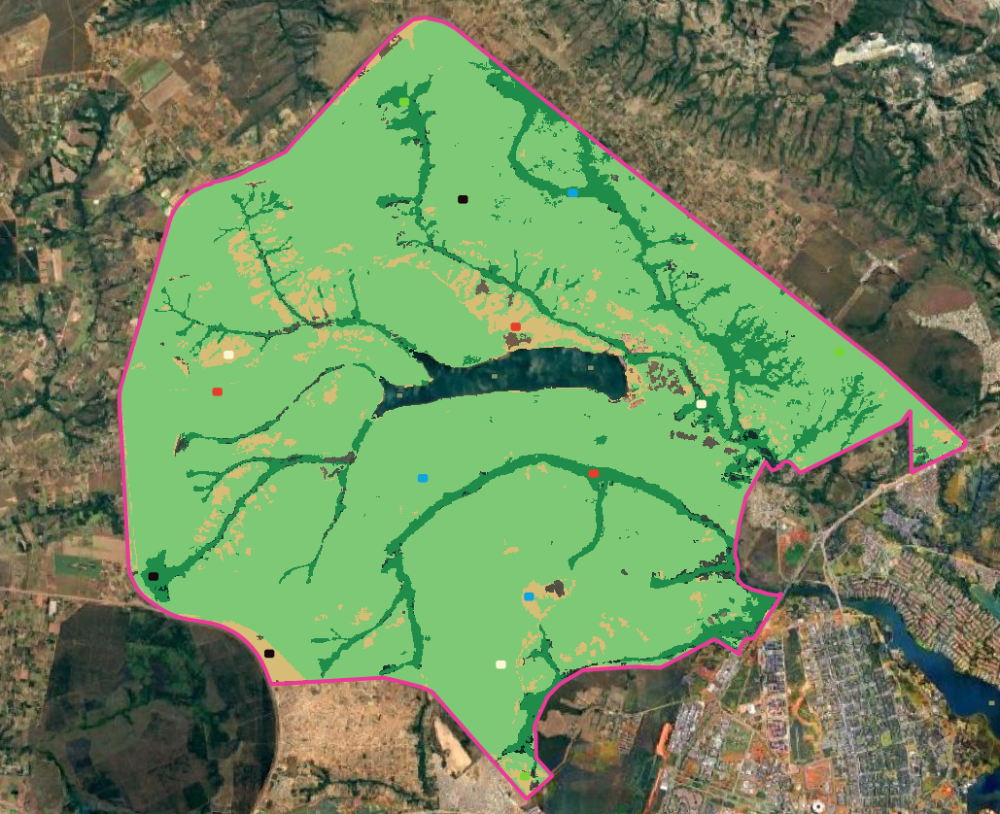

```{r setup}
knitr::opts_chunk$set(message=FALSE, warning=FALSE, error=FALSE)
library(ggplot2)
library(ggthemes)
  theme_set(theme_pander() +
              theme(text=element_text(family="serif")))
library(readr)
library(reshape2)
library(twosamples)
```

# Introdução

Este estudo trata de uma análise de dados de intensidade do sinal do Sentinel-1 sobre a vegetação nativa do Cerrado.
As três principais fitofisionomias do Cerrado são os alvos desta investigação: Formação Florestal, Formação Savânica e Formação Campestre.
Cada fitofisionomia é tratada neste estudo como uma classe temática, e sua extensão é dada pelo mapa de uso e cobertura do solo (Land Use and Land Cover - LULC) de 2025 do MapBiomas, com resolução espacial de 10 m.
A área estudada compreende o Parque Nacional de Brasília (PNB), Brasil.

Como fonte de dados SAR, utilizamos os dados do Sentinel-1 (banda C), com as polarizações VV e VH e resolução espacial de 10 m após o processamento de multilook com uma janela de 2x1.
A partir desse dado, extraiu-se as componentes da matriz C2.
A componente C11 corresponde à intensidade do sinal na polarização VV, e a componente C22 corresponde à intensidade do sinal na polarização VH.
A cena foi obtida através do portal Alaska Satellite Facility (ASF), com identificador S1D_IW_SLC__1SDV_20260625T084430_20260625T084457_003390_005F64_AC59

A ideia central deste estudo é verificar se amostras de uma mesma classe conhecida a priori são homogêneas no domínio espacial.
Parte-se do princípio de que caso as amostras sejam homogêneas no espaço, toda a classe pode ser modelada por uma mesma função de distribuição cumulativa.
Nesse sentido, o objetivo deste estudo é testar a hipótese de homogeneidade no domínio espacial das classes de vegetação nativa do Cerrado.
Esta é uma iniciativa que visa a compreensão dos dados SAR sobre o Cerrado, de modo a contribuir com o aperfeiçoamento do monitoramento e combate ao desmatamento no Cerrado brasileiro.

Foram definidas 5 amostras espalhadas pelo domínio espacial das classes.
Cada amostra recebeu um rótulo com uma cor: Branco (W), Azul (U), Preto (B), Vermelho (R) e Verde (G).
Os polígonos amostrais possuem geometria retangular com 200 m x 150 m, totalizando 300 observações por amostra.
Cada observação é um vetor contendo as intensidades das duas polarizações $O_{i} = (I_{VV}, I_{VH})$.



# Análise não-paramétrica

Precisamos verificar se as amostras foram geradas pela mesma distribuição.

```{r LeituraDeDados}

Fo_W <- read_csv("Data/pnb_samples/sentinel_1/Fo_W.csv")
Fo_U <- read_csv("Data/pnb_samples/sentinel_1/Fo_U.csv")
Fo_B <- read_csv("Data/pnb_samples/sentinel_1/Fo_B.csv")
Fo_R <- read_csv("Data/pnb_samples/sentinel_1/Fo_R.csv")
Fo_G <- read_csv("Data/pnb_samples/sentinel_1/Fo_G.csv")
Sv_W <- read_csv("Data/pnb_samples/sentinel_1/Sv_W.csv")
Sv_U <- read_csv("Data/pnb_samples/sentinel_1/Sv_U.csv")
Sv_B <- read_csv("Data/pnb_samples/sentinel_1/Sv_B.csv")
Sv_R <- read_csv("Data/pnb_samples/sentinel_1/Sv_R.csv")
Sv_G <- read_csv("Data/pnb_samples/sentinel_1/Sv_G.csv")
Gl_W <- read_csv("Data/pnb_samples/sentinel_1/Gl_W.csv")
Gl_U <- read_csv("Data/pnb_samples/sentinel_1/Gl_U.csv")
Gl_B <- read_csv("Data/pnb_samples/sentinel_1/Gl_B.csv")
Gl_R <- read_csv("Data/pnb_samples/sentinel_1/Gl_R.csv")
Gl_G <- read_csv("Data/pnb_samples/sentinel_1/Gl_G.csv")

amostras_por_classe <- list(
  Floresta = list(Fo_W=Fo_W, Fo_U=Fo_U, Fo_B=Fo_B, Fo_R=Fo_R, Fo_G=Fo_G),
  Savana = list(Sv_W=Sv_W, Sv_U=Sv_U, Sv_B=Sv_B, Sv_R=Sv_R, Sv_G=Sv_G),
  Campestre = list(Gl_W=Gl_W, Gl_U=Gl_U, Gl_B=Gl_B, Gl_R=Gl_R, Gl_G=Gl_G)
)
```

Resumo dos dados

```{r DataTransformation}
amostras_rotuladas <- do.call(c, amostras_por_classe)
classe_por_amostra <- rep(names(amostras_por_classe),
                          lengths(amostras_por_classe))
names(classe_por_amostra) <- names(amostras_rotuladas)
Intensities <- do.call(rbind, lapply(names(amostras_rotuladas), function(imagem) {
  data.frame(amostras_rotuladas[[imagem]][, -1],
             Image=imagem,
             Classe=classe_por_amostra[[imagem]])
}))

Intensities.molten <- reshape2::melt(
  Intensities,
  id.vars=c("Image", "Classe"),
  variable.name="Band",
  value.name="Intensity"
)

summary(Intensities.molten)

Tabela_Intervalo <- aggregate(data = Intensities.molten, 
                          Intensity ~ Image + Band, 
                          FUN=summary)
```

Histogramas suavizados

```{r Histograms}
ggplot(Intensities.molten, aes(x=Intensity, col=Image)) +
  geom_density(linewidth=1.2, alpha=.5) +
  ylab("Empirical densities") +
  facet_grid(Classe ~ Band, scales="free")
```

```{r Boxplots}
ggplot(Intensities.molten, aes(x=Image, y=Intensity, col=Image)) +
  geom_boxplot(notch=TRUE) +
  ylab("Intensity") +
  xlab("Sample") +
  facet_grid(Classe ~ Band, scales="free_y")
```

QQ-plots

```{r QQplots}
ggplot(Intensities.molten, aes(sample=Intensity, col=Image)) +
  stat_qq_line() +
  stat_qq() +
  ylab("Sample quantiles") +
  xlab("Theoretical quantiles") +
  facet_grid(Classe ~ Band, scales="free")
```

Testes de permutações para comparar as amostras

```{r PermutationTests}
bandas <- c(VV = "IVV", VH = "IVH")
set.seed(2024)
resultados_permutacao <- do.call(rbind, lapply(names(amostras_por_classe), function(classe) {
  amostras <- amostras_por_classe[[classe]]
  pares <- combn(names(amostras), 2, simplify=FALSE)
  do.call(rbind, lapply(names(bandas), function(banda) {
    variavel <- bandas[[banda]]
    do.call(rbind, lapply(pares, function(par) {
      teste <- dts_test(amostras[[par[1]]][[variavel]],
                        amostras[[par[2]]][[variavel]])
      data.frame(
        Classe = classe,
        Banda = banda,
        Comparacao = paste(sub("^[A-Za-z]+_", "", par), collapse=" vs. "),
        p_valor = unname(teste[["P-Value"]])
      )
    }))
  }))
}))

tabela_permutacao <- function(resultados) {
  resultados <- resultados[order(resultados$Classe, resultados$Banda,
                                 resultados$Comparacao), ]
  knitr::kable(
    data.frame(
      Classe = resultados$Classe,
      Banda = resultados$Banda,
      Comparacao = resultados$Comparacao,
      p_valor = format.pval(resultados$p_valor, digits = 3, eps = 0.001)
    ),
    col.names = c("Classe", "Banda", "Comparação entre amostras", "p-valor")
  )
}
```

Considera-se significância de 1%: não se rejeita a hipótese nula quando $p \geq 0{,}01$ e rejeita-se quando $p < 0{,}01$.

### Casos em que não se rejeita a hipótese nula

```{r PermutationTestsNotRejected}
tabela_permutacao(subset(resultados_permutacao, p_valor >= 0.01))
```

### Casos em que se rejeita a hipótese nula

```{r PermutationTestsRejected}
tabela_permutacao(subset(resultados_permutacao, p_valor < 0.01))

```

# Análise paramétrica

Verificaremos os ajustes de modelos gama com esses parâmetros de forma.
Sob o modelo multiplicativo e em áreas com speckle totalmente desenvolvido, o retorno de intensidade segue uma distribuição gama de parâmetro de forma $L$,
o número equivalente de looks, e média $\mu$.
Essa distribuição é caracterizada pela função de densidade de probabilidade
\begin{equation}
f_Z(z;L,\mu) 
=
\frac{L^L}{\Gamma(L)\mu^L}
z^{L-1}\exp\Big(-\frac{Lz}{\mu}\Big) 
\mathbb I_{\mathbb R_+}(z).
\label{eq:dgamaLmu}
\end{equation}

## ENL da cena completa

O número equivalente de looks é $2.0574$ para C11 (VV) e $2.0788$ para C22
(VH). Esses valores foram obtidos a partir de amostras extraídas sobre corpos
d'água e solo exposto na cena completa e são usados aqui como estimativas
globais.

```{r ENL, echo=FALSE}
LVV <- 2.0574
LVH <- 2.0788
```

Para cada classe de cobertura, comparamos três parametrizações:
1. Os parâmetros estimados por `MASS::fitdistr`;
2. ENL da amostra e média da amostra;
3. ENL da cena completa e média da amostra.

```{r FuncoesAnaliseGamma, echo=FALSE}
ajustar_gamma <- function(x) {
  escala <- mean(x)
  ajuste <- MASS::fitdistr(x / escala, densfun="gamma")
  list(estimate=c(
    shape=unname(ajuste$estimate["shape"]),
    rate=unname(ajuste$estimate["rate"]) / escala
  ))
}

ajustar_amostras <- function(amostras) {
  intensidades <- do.call(rbind, lapply(names(amostras), function(imagem) {
    data.frame(amostras[[imagem]][, -1], Image=imagem)
  }))
  dados <- reshape2::melt(
    intensidades,
    id.vars="Image",
    variable.name="Band",
    value.name="Intensity"
  )
  dados$Image <- factor(dados$Image, levels=names(amostras))

  grupos <- split(dados, list(dados$Image, dados$Band), drop=TRUE)
  ajustes <- lapply(grupos, function(amostra) {
    ajustar_gamma(amostra$Intensity)
  })
  tabela <- do.call(rbind, lapply(names(grupos), function(grupo) {
    amostra <- grupos[[grupo]]
    cv <- sd(amostra$Intensity) / mean(amostra$Intensity)
    data.frame(
      Image=as.character(amostra$Image[1]),
      Band=as.character(amostra$Band[1]),
      shape=unname(ajustes[[grupo]]$estimate["shape"]),
      ENL_amostra=1 / cv^2
    )
  }))

  list(dados=dados, ajustes=ajustes, tabela=tabela)
}

plot_gamma_fit <- function(analise, imagem, banda, L_cena) {
  dados <- data.frame(
    intensidade=subset(analise$dados, Image==imagem & Band==banda)$Intensity
  )
  estim_gamma <- analise$ajustes[[paste(imagem, banda, sep=".")]]
  media <- mean(dados$intensidade)
  enl_amostra <- subset(analise$tabela,
                        Image==imagem & Band==banda)$ENL_amostra

  ggplot(dados, aes(x=intensidade)) +
    geom_histogram(aes(y=after_stat(density)),
                   bins=nclass.FD(dados$intensidade),
                   col="black", fill="white") +
    labs(title=paste(imagem, banda),
         x=NULL, y=NULL, color=NULL) +
    geom_density(aes(color="Densidade empírica"),
                 linewidth=.6, alpha=.9, key_glyph="path") +
    stat_function(fun=dgamma,
                  aes(color="Gamma ajustada"),
                  args=list(shape=unname(estim_gamma$estimate["shape"]),
                            rate=unname(estim_gamma$estimate["rate"])),
                  linewidth=1.4) +
    stat_function(fun=dgamma,
                  aes(color="Gamma com ENL da amostra"),
                  args=list(shape=enl_amostra,
                            scale=media/enl_amostra),
                  linewidth=1.3) +
    stat_function(fun=dgamma,
                  aes(color="Gamma com ENL da cena completa"),
                  args=list(shape=L_cena,
                            scale=media/L_cena),
                  linewidth=1.3) +
    scale_color_manual(
      name="Distribuição",
      values=c("Densidade empírica"="black",
               "Gamma ajustada"="#0072B2",
               "Gamma com ENL da amostra"="#D55E00",
               "Gamma com ENL da cena completa"="#009E73")
    )
}
```

## Amostras de Floresta (Fo)

```{r AnaliseGammaFo, echo=FALSE}
analise_Fo <- ajustar_amostras(list(
  FoB=Fo_B, FoR=Fo_R, FoW=Fo_W, FoU=Fo_U, FoG=Fo_G
))
knitr::kable(analise_Fo$tabela, digits=4,
             col.names=c("Imagem", "Banda", "shape (fitdistr)",
                         "ENL da amostra (1/CV^2)"))
for (imagem in levels(analise_Fo$dados$Image)) {
  print(plot_gamma_fit(analise_Fo, imagem, "IVV", LVV))
  print(plot_gamma_fit(analise_Fo, imagem, "IVH", LVH))
}
```

## Amostras de Savana (Sv)

```{r AnaliseGammaSv, echo=FALSE}
analise_Sv <- ajustar_amostras(list(
  SvB=Sv_B, SvR=Sv_R, SvW=Sv_W, SvU=Sv_U, SvG=Sv_G
))
knitr::kable(analise_Sv$tabela, digits=4,
             col.names=c("Imagem", "Banda", "shape (fitdistr)",
                         "ENL da amostra (1/CV^2)"))
for (imagem in levels(analise_Sv$dados$Image)) {
  print(plot_gamma_fit(analise_Sv, imagem, "IVV", LVV))
  print(plot_gamma_fit(analise_Sv, imagem, "IVH", LVH))
}
```

## Amostras de Campestre (Gl)

```{r AnaliseGammaGl, echo=FALSE}
analise_Gl <- ajustar_amostras(list(
  GlB=Gl_B, GlR=Gl_R, GlW=Gl_W, GlU=Gl_U, GlG=Gl_G
))
knitr::kable(analise_Gl$tabela, digits=4,
             col.names=c("Imagem", "Banda", "shape (fitdistr)",
                         "ENL da amostra (1/CV^2)"))
for (imagem in levels(analise_Gl$dados$Image)) {
  print(plot_gamma_fit(analise_Gl, imagem, "IVV", LVV))
  print(plot_gamma_fit(analise_Gl, imagem, "IVH", LVH))
}
```

Os valores de `shape` e os ENL da amostra estimados por $1/CV^2$ podem ser
comparados em cada tabela. Os três gráficos por amostra permitem comparar os
ajustes de máxima verossimilhança, o ENL amostral e o ENL global da cena.

Os gráficos permitem uma avaliação visual do ajuste, mas não são suficientes
para concluir que o modelo gama é adequado. A seção seguinte apresenta um teste
de aderência com bootstrap paramétrico, que reestima os parâmetros em cada
réplica.

# Teste de aderência à distribuição gama (goodness-of-fit)


```{r FuncaoTesteAderenciaBootstrapParametrico}
estatistica_ks_gama <- function(x, shape, rate) {
  x <- sort(x)
  n <- length(x)
  f <- pgamma(x, shape=shape, rate=rate)
  i_min <- rank(x, ties.method="min")
  i_max <- rank(x, ties.method="max")
  max(i_max / n - f, f - (i_min - 1) / n)
}

# Reestima os parâmetros em cada réplica para calibrar o teste com bootstrap.
teste_aderencia_gama <- function(x, B = 999) {
  n <- length(x)

  ajuste <- ajustar_gamma(x)
  shape_hat <- ajuste$estimate["shape"]
  rate_hat <- ajuste$estimate["rate"]
  D_obs <- estatistica_ks_gama(x, shape_hat, rate_hat)

  D_sim <- numeric(B)
  for (b in seq_len(B)) {
    xb <- rgamma(n, shape=shape_hat, rate=rate_hat)
    ajuste_b <- ajustar_gamma(xb)
    D_sim[b] <- estatistica_ks_gama(
      xb,
      ajuste_b$estimate["shape"],
      ajuste_b$estimate["rate"]
    )
  }

  (1 + sum(D_sim >= D_obs)) / (B + 1)
}
```

Aplicamos o teste a todas as amostras das três classes (Fo, Sv, Gl) e às duas polarizações (VV e VH).

```{r TesteAderenciaBootstrapParametrico}
amostras_gof <- list(
  FoB=Fo_B, FoR=Fo_R, FoW=Fo_W, FoU=Fo_U, FoG=Fo_G,
  SvB=Sv_B, SvR=Sv_R, SvW=Sv_W, SvU=Sv_U, SvG=Sv_G,
  GlB=Gl_B, GlR=Gl_R, GlW=Gl_W, GlU=Gl_U, GlG=Gl_G
)
classes_gof <- c(Fo="Floresta", Sv="Savana", Gl="Campestre")
bandas_gof <- c(VV="IVV", VH="IVH")

set.seed(2024)
resultados_aderencia <- do.call(rbind, lapply(names(amostras_gof), function(imagem) {
  classe <- classes_gof[[substr(imagem, 1, 2)]]
  do.call(rbind, lapply(names(bandas_gof), function(banda) {
    variavel <- bandas_gof[[banda]]
    x <- amostras_gof[[imagem]][[variavel]]
    data.frame(
      Classe = classe,
      Imagem = imagem,
      Banda = banda,
      p_valor = teste_aderencia_gama(x)
    )
  }))
}))

tabela_aderencia <- function(resultados) {
  resultados <- resultados[order(resultados$Classe, resultados$Imagem, resultados$Banda), ]
  knitr::kable(
    data.frame(
      Classe = resultados$Classe,
      Imagem = resultados$Imagem,
      Banda = resultados$Banda,
      p_valor = format.pval(resultados$p_valor, digits = 3, eps = 0.001)
    ),
    col.names = c("Classe", "Imagem", "Banda", "p-valor")
  )
}
```

Considera-se significância de 1%: não se rejeita a hipótese nula de ajuste à gama quando $p \geq 0{,}01$ e rejeita-se quando $p < 0{,}01$.

### Casos em que não se rejeita o ajuste à gama

```{r TesteAderenciaNotRejected}
tabela_aderencia(subset(resultados_aderencia, p_valor >= 0.01))
```

### Casos em que se rejeita o ajuste à gama

```{r TesteAderenciaRejected}
tabela_aderencia(subset(resultados_aderencia, p_valor < 0.01))
```

Os resultados devem ser interpretados com cautela: os testes de permutação e
aderência assumem observações independentes, enquanto pixels vizinhos podem
apresentar autocorrelação espacial.